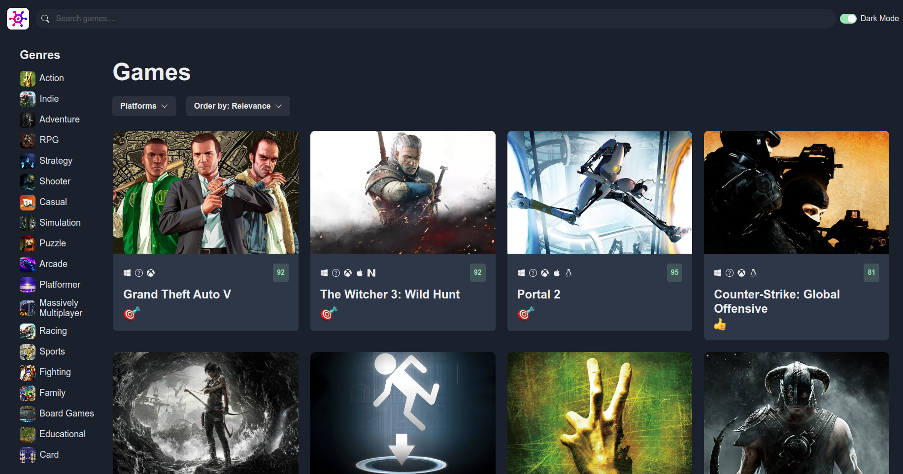
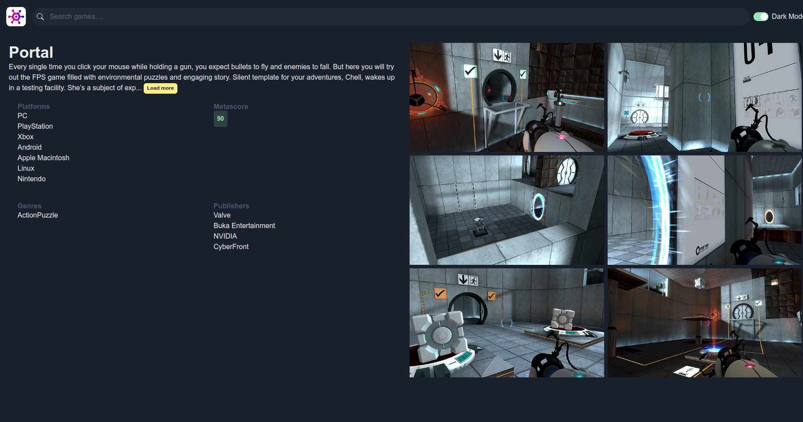
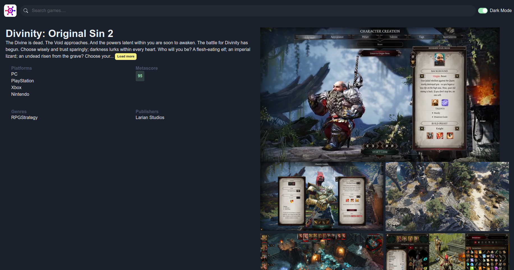
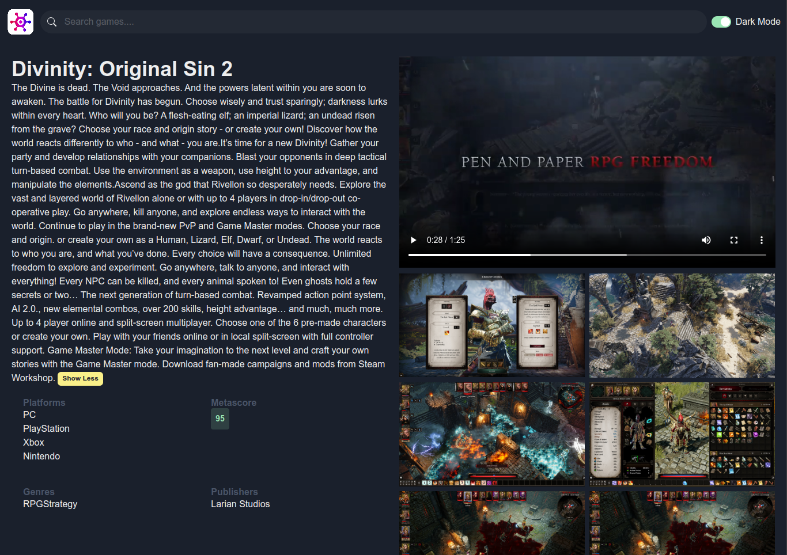

<!-- Improved compatibility of back to top link: See: https://github.com/othneildrew/Best-README-Template/pull/73 -->

<a id="readme-top"></a>

<!-- PROJECT LOGO -->
<br />
<div align="center">
  <a href="https://github.com/Dora800201/game_hub">
    
  </a>

<h3 align="center">GameHub</h3>

  <p align="center">
    GameHub is a web application that allows users to browse games by category, view ratings, read descriptions, and explore game screenshots and trailers. Built with React, Bootstrap, Chakra UI, and external APIs, this project demonstrates the integration of modern web technologies.
    <br />
    <a href="https://game-hub-dusky-phi.vercel.app/">View Demo</a>
    &middot;
</div>

[![React][React.js]][React-url]
[![Bootstrap][Bootstrap.com]][Bootstrap-url]


## Showcase






<p align="right">(<a href="#readme-top">back to top</a>)</p>

## Running a local instance

Getting a local instance running can be achieved with the following steps.

### Prerequisites

This is an example of how to list things you need to use the software and how to install them.

- npm
  ```sh
  npm install npm@latest -g
  ```

### Installation

1. Get a free API Key at [https://rawg.io/apidocs](https://rawg.io/apidocs)
2. Clone the repo
   ```sh
   git clone https://github.com/Dora800201/game_hub.git
   ```
3. Install NPM packages
   ```sh
   npm install
   ```
4. Enter your API in `src/services/api-client.ts`
   ```js
   const API_KEY = "YOUR API KEY";
   ```
5. Change git remote url to avoid accidental pushes to base project
   ```sh
   git remote set-url origin github_username/repo_name
   git remote -v # confirm the changes
   ```

<p align="right">(<a href="#readme-top">back to top</a>)</p>

<!-- ROADMAP -->

## Roadmap

- [ ] Image gallery view
- [ ] New releases
- [ ] Detailed hover
- [ ] Background images

<p align="right">(<a href="#readme-top">back to top</a>)</p>

<!-- CONTACT -->

## Contact

Dora Lin

Project Link: [https://github.com/Dora800201/game_hub](https://github.com/Dora800201/game_hub)

<p align="right">(<a href="#readme-top">back to top</a>)</p>

<!-- MARKDOWN LINKS & IMAGES -->
<!-- https://www.markdownguide.org/basic-syntax/#reference-style-links -->

[contributors-shield]: https://img.shields.io/github/contributors/Dora800201/game_hub.svg?style=for-the-badge
[contributors-url]: https://github.com/Dora800201/game_hub/graphs/contributors
[forks-shield]: https://img.shields.io/github/forks/Dora800201/game_hub.svg?style=for-the-badge
[forks-url]: https://github.com/Dora800201/game_hub/network/members
[stars-shield]: https://img.shields.io/github/stars/Dora800201/game_hub.svg?style=for-the-badge
[stars-url]: https://github.com/Dora800201/game_hub/stargazers
[issues-shield]: https://img.shields.io/github/issues/Dora800201/game_hub.svg?style=for-the-badge
[issues-url]: https://github.com/Dora800201/game_hub/issues
[license-shield]: https://img.shields.io/github/license/Dora800201/game_hub.svg?style=for-the-badge
[license-url]: https://github.com/Dora800201/game_hub/blob/master/LICENSE.txt
[linkedin-shield]: https://img.shields.io/badge/-LinkedIn-black.svg?style=for-the-badge&logo=linkedin&colorB=555
[linkedin-url]: https://linkedin.com/in/-dora-lin-
[product-screenshot]: images/screenshot.png
[React.js]: https://img.shields.io/badge/React-20232A?style=for-the-badge&logo=react&logoColor=61DAFB
[React-url]: https://reactjs.org/
[Bootstrap.com]: https://img.shields.io/badge/Bootstrap-563D7C?style=for-the-badge&logo=bootstrap&logoColor=white
[Bootstrap-url]: https://getbootstrap.com
